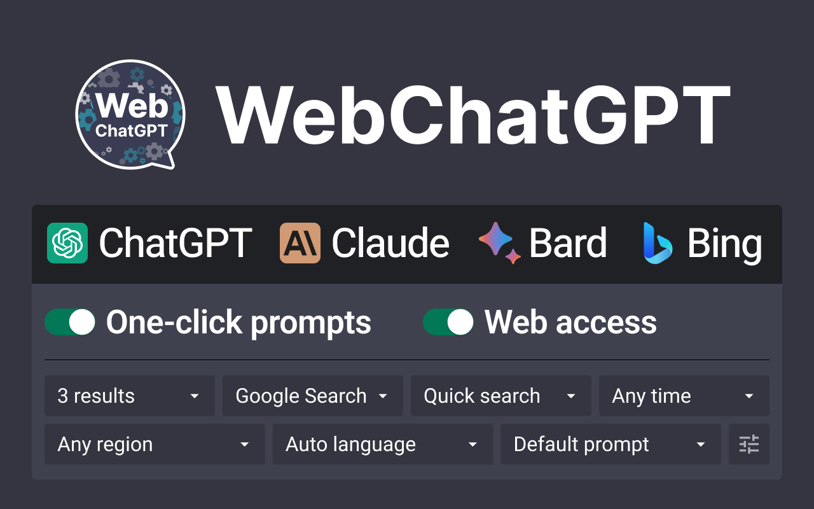

# How To Connect ChatGPT To The Internet?

A complete guide to connect free version of chatgpt to the internet by [@mahseema](https://github.com/mahseema)

- [WebChatGPT](#using-webchatgpt-to-connect-chatgpt-to-the-internet)
- [Frequently Asked Questions](#faq)

## Using WebChatGPT To Connect ChatGPT To The Internet

1. **Install the plugin**

The [WebChatGPT](https://tools.zmo.ai/webchatgpt) plugin is available for [Chrome](https://chrome.google.com/webstore/detail/webchatgpt-chatgpt-with-i/lpfemeioodjbpieminkklglpmhlngfcn), [Firefox](https://addons.mozilla.org/en-US/firefox/addon/web-chatgpt/), and [Edge](https://microsoftedge.microsoft.com/addons/detail/webchatgpt-chatgpt-with-/flahobhjikkpnpohomeckhdjjkkkkmoc) browsers. You can install it from the Chrome Web Store, Firefox Add-ons, or Microsoft Edge Add-ons.

2. **Open ChatGPT**

Once you have installed the plugin, open [ChatGPT](https://chat.openai.com). You will see a new interface at the bottom of the message area.

3. **Type your query**

In the new interface, type your query. You can also choose to change the number of web results, the time frame for the results, and the region where the results originate.

4. **Click "Send"**

Click the "Send" button to send your query to WebChatGPT. WebChatGPT will then retrieve web results for your query and generate a summary of the results.

FAQ
----

### Can you connect chatgpt (free version) to the internet?

If you're on a free account on ChatGPT, the responses you get won't include information from the internet. But you can use plugins like WebchatGPT to connect the free version of chatGPT to the Internet.

### Is chatgpt connected to the internet?

Indeed, ChatGPT offers internet connectivity! By subscribing to either ChatGPT Plus or ChatGPT Enterprise, users gain access to the GPT-4 model, equipped with web browsing capabilities. Also with this articles tutorials you can connect the free version of chatGPT to the Internet.

### Is chatgpt 4 connected to the internet?

Yes. With a paid subscription to ChatGPT Plus or ChatGPT Enterprise.

